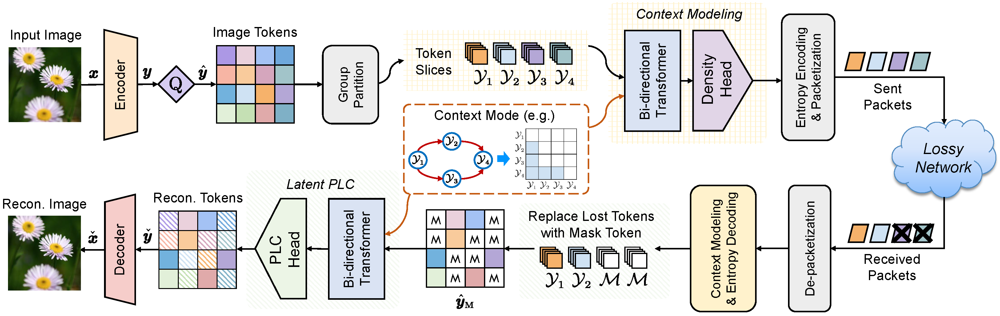

# ResiComp: Loss-Resilient Image Compression via Dual-Functional Masked Visual Token Modeling
This is the repository of the
paper "[ResiComp: Loss-Resilient Image Compression via Dual-Functional Masked Visual Token Modeling](https://arxiv.org/abs/2502.10812)".

## Overview of ResiComp



## Requirements

Clone the repo and create a conda environment (we use PyTorch 1.9, CUDA 11.1).

The dependencies
includes [CompressAI](https://github.com/InterDigitalInc/CompressAI).


## Pre-trained Models

Download the pre-trained models
from [Google Drive](https://drive.google.com/drive/folders/1vUpebtcCJpb8DgCiKS0UrP3JPVDFdatU?usp=drive_link).

## Train and Evaluate


```bash
python main.py --config './config/resicom.yaml' 
```

## Acknowledgement

Codebase
from [CompressAI](https://github.com/InterDigitalInc/CompressAI) and [Swin Transformer](https://github.com/microsoft/Swin-Transformer)

## Citation

If you find this code useful for your research, please cite our paper

```
@ARTICLE{10877904,
  author={Wang, Sixian and Dai, Jincheng and Qin, Xiaoqi and Yang, Ke and Niu, Kai and Zhang, Ping},
  journal={IEEE Transactions on Circuits and Systems for Video Technology}, 
  title={ResiComp: Loss-Resilient Image Compression via Dual-Functional Masked Visual Token Modeling}, 
  year={2025},
  volume={},
  number={},
  pages={1-1},
  keywords={Context modeling;Packet loss;Resilience;Entropy;Image coding;Codecs;Transforms;Transformers;Adaptation models;Forward error correction},
  doi={10.1109/TCSVT.2025.3539747}}

```